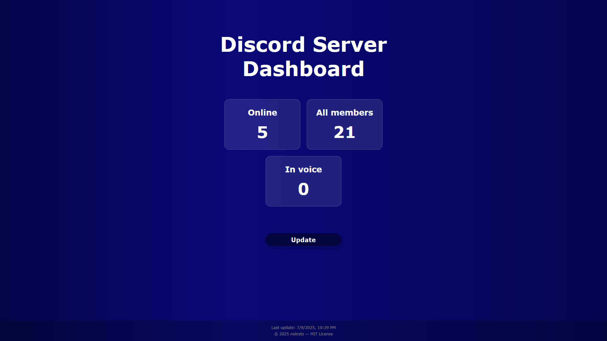
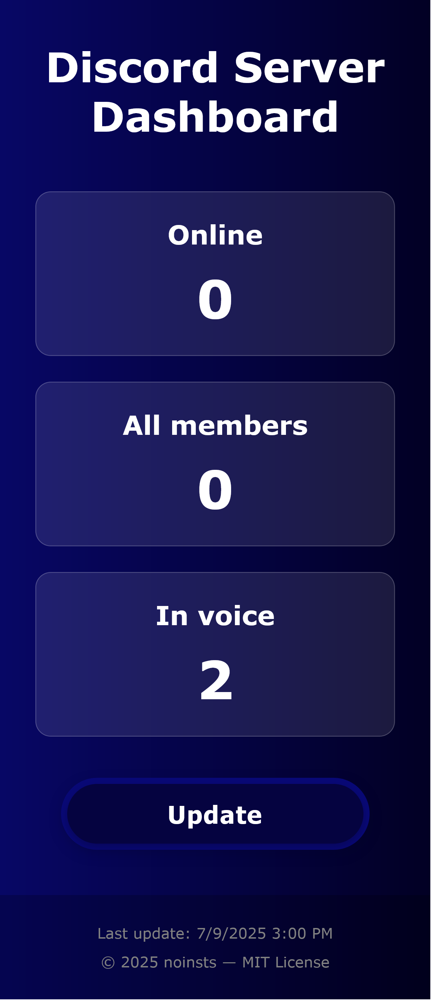

[](https://wakatime.com/badge/user/5f28d705-3bc8-4138-8151-e12e0f9e9a23/project/abc20e82-72d8-48bb-a970-098ffff1baec)

Ви спілкуєтесь українською? [Українська версія](./README.md)

# discord-dashboard

**Discord Dashboard** is a simple web app to see your Discord server stats in real-time.

## 🚀 Why it's cool?

- **All-in-one view**: Get all your server stats in one convenient place.  
- **Easy setup**: Connect your server and start monitoring in no time.  
- **Modern design**: Enjoy a clean, responsive UI that looks great on any device.  
- **Open source**: Feel free to add your own features and customize it however you want.

## 📌 Note

I'm new to web development, so the code might have some rough edges. If you find bugs or have ideas, I'd appreciate your feedback! Please don’t judge too harshly and help me improve 🙌

## 🖼️ Preview

### 💻 Desktop



### 📱 Mobile



## 🧱 Tech stack

### Backend:
- 🐍 [Python 3.12](https://www.python.org/downloads/release/python-3124/)  
- 🌐 [Flask](https://flask.palletsprojects.com/) — web server  
- 🤖 [discord.py](https://discordpy.readthedocs.io/en/stable/) — Discord API integration  
- 📦 [Poetry](https://python-poetry.org/) — dependency manager  
- 🔐 [python-dotenv](https://pypi.org/project/python-dotenv/) — manages your secrets  

### Frontend:
- 🧱 [HTML](https://en.wikipedia.org/wiki/HTML) — page structure  
- 🎨 [CSS](https://en.wikipedia.org/wiki/CSS) — styles and design  
- ⚙️ [JavaScript](https://en.wikipedia.org/wiki/JavaScript) — frontend logic and dynamic updates  

## ⚙️ Installation

### 1. Clone the repo and install dependencies

```bash
git clone https://github.com/noinsts/discord-dashboard.git
cd discord-dashboard
poetry install
```

### 2. Setup your Discord secrets

1. Create a `.env` file  
   ```bash
   touch .env
   ```  
2. Add your Discord token and server ID (see `.env.example` for reference)

### 3. Configure Flask server

Edit `src/backend/config.py` if needed:  
```python
FLASK_HOST = '0.0.0.0'
FLASK_PORT = 8080
FLASK_DEBUG = True

LIVERELOAD_PORT = 9098
```

### 4. Run the project

```bash
poetry run python src/backend/main.py
```

## License

The project is distributed under the [MIT License](./LICENSE)

## Author

[noinsts](https://github.com/noinsts) — author of this project
